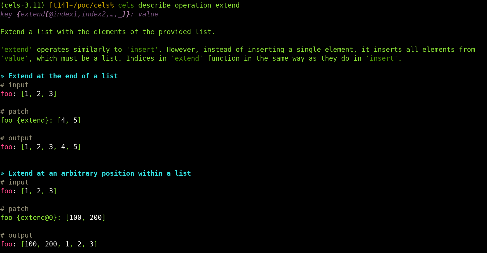
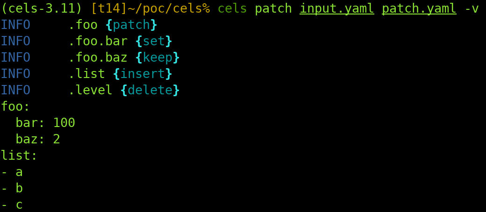

<p align="center">
    
</p>

cels
====


_Command line tool to patch your YAML and JSON files_

## Example

```yaml
# input.yaml
foo:
  bar: 1
  baz: 2
list:
- a
- b
level: 11
```

```yaml
# patch.yaml
foo:
  bar: 100
list {insert}: c
level {delete}: null
```

```
$ cels patch input.yaml patch.yaml
foo:
  bar: 100
  baz: 2
list:
- a
- b
- c
```

## Description

Cels is a command-line tool and Python library that enables you to make multiple
modifications to YAML, JSON, or TOML documents. These modifications are based on
changes specified in a _patch_ file. The patch file is written in the same
format as the original data and mirrors its structure. For instance, if you want
to change the `bar` key value from `hello` to `bye` in this example:
```
foo:
  bar: hello
```
You simply need to create a patch like this:
```
foo:
  bar: bye
```
For more complex modifications, you can annotate the keys of the patch
document with the operation to perform in the format: `{operation[@index1,
index2, …]}`. For example, to insert an element in the middle of a list, you
only need to specify the new location and the value to insert:
```yaml

# input
list:
- a
- c

# patch
list {insert@1}: b

# output
list:
- a
- b
- c
```

Working with JSON files in Cels is quite similar to working with YAML files. To
illustrate this, let's take a look at how the previous example would be
transformed:

Here's the input file:
```json
{
  "list": ["a", "c"]
}
```
And here's the patch file:
```json
{
  "list {insert@1}": "b"
}
```
After applying the patch, the result would be:
```json
{
  "list": ["a", "b", "c"]
}
```

Cels supports a variety of operations (`set`, `delete`, `rename`, `insert`,
`extend`, `use`, `link`, `render`), and most of them can optionally take indices
to work with any level of nested lists.

Cells can be beneficial when you possess a base configuration file or manifest
for a system and need to tailor it to various environments (eg. 'development'
and 'production'). Additionally, you can utilize Cells as a Python library and
integrate it into your application. This allows your users to modify their own
configuration in diverse setups (similar to `docker-compose` overrides, for
example).

Refer to [Usage](#usage) for a comprehensive description of all available
operations.

See [Similar Projects](#similar-projects) for a comparison between Cels and
other tools and specifications with similar objectives.

> _What's the origin of the project name?_
> The name 'Cels' is inspired by the conventional, analog world of animation. In
> that context, 'cels' are transparent sheets featuring drawings that are layered
> atop one another to create the final image. This is conceptually similar
> (somehow) to how Cels operates with input and patch files.

### Limitations

When considering the use of Cels, it's important to note that there are two key
limitations to its functionality:

* Cels is only compatible with documents where the top-level element is
  a dictionary or map. It does not work with documents where the top-level
  element is a list.
* Annotations can only be added to keys that are of the string type.
  This isn't a problem with JSON documents, as all keys are inherently strings.
  However, in YAML documents, keys aren't necessarily strings. While Cels can
  handle YAML documents with non-string keys, and these keys can also appear in
  patch files, they cannot be annotated. This means that advanced operations
  cannot be applied to them.

## Installation

To install cells, simply use `pip`:
```
pip install cells
```

## Usage

> This section gives you a very complete overview on how to use the tool. Check [Reference](#reference)  if you prefer to get the list of
operations and their meaning.

### The 'patch' command

Cels' main command is `patch`. It takes an input file (the file that you want to
modify) and a patch file (the file that describes the changes to perform). Eg:
```shell
$ cels patch input.yaml patch.yaml
```
The result or running the command is sent to `stdout` by default. To save the
result to a file, just redirect the output or use the `-O` option:
```shell
$ cels patch input.yaml patch.yaml > output.yaml
$ cels patch input.yaml patch.yaml -O output.yaml
```
You can patch YAML, JSON and TOML files. Cels determines the correct format to
use from the file extensions, but you can explicitly set the format for each one
of the files with the `-i`, `-p`, and `-o` parameters (run `cels patch --help`
for more information).

> _Note_: It's possible to utilize various formats within the same command
> execution. For instance, you can use a JSON patch and a YAML input file
> simultaneously if you wish. Although there aren't many reasons to typically do
> this, Cels doesn't place any limitations on the combination of formats used.

### Basic operations

To override values of the input document, you don't typically need to specify
any operation in the patch file:
```
# input
foo:
    bar:
        a: 1
        b: 2
        c: 3

# patch
foo:
    bar:
        b: 200

# output
foo:
    bar:
        a: 1
        b: 200
        c: 3
```
As shown in this example, dictionaries in the patch file get merged with
the ones in the input file. However, if you want to override an entire
dictionary, instead of merging it, you can use the operation `set`:
```
# input
foo:
    bar:
        a: 1
        b: 2
        c: 3

# patch
foo:
    bar {set}:
        b: 200

# output
foo:
    bar:
        b: 200
```
Operations are specified by annotating the dictionary key with appending the
text `{<operation>}` to it. Actually, the full annotation format is:
```
key {<operation>[@<index1>,<index2>,...]}
```
where the indices are provided to modify lists (see below [Working with
lists](#working-with-lists) for more information on that.

The `set` operation is the default one for all data types except for
dictionaries, which means that most of the time you don't have to explicitly use
it. For dictionaries, the default operation is `patch`, which merges the keys of
the dictionary with the associated dictionary in the input file.

#### 'delete' and 'rename'

Other basic operations are `delete`, which deletes a key from the input file and
`rename`, which changes the name of a key, but keeps its value:
```
# input
foo:
    bar: "A Fair Field Full of Folk"
    baz:
        one: 1
        two: 2

# patch
foo:
    bar {rename}: newbar
    baz {delete}: null

# output
foo:
    newbar "A Fair Field Full of Folk"
```
For the `delete` operation, you can pass any value (in this case `null`) as it
is just ignored by Cels.

## Working with Lists

The majority of operations can utilize an index following an `@` symbol. This is
to indicate that the action should be executed at a specific position within a
list.

For example, to change the second element of a list, you can use the `set`
operation:

```yaml
# input
foo:
  - a
  - b

# patch
foo {set@1}: B

# output
foo:
  - a
  - B
```

Note that when working with lists:

* Indices start at 0 (meaning the first element is located at index 0).
* Negative indices can be used. For instance, -1 refers to the last element in
  the list, -2 to the penultimate one, and so on.
* To specify elements within nested lists, you can provide multiple indices
  separated by commas. For example, `1,1` refers to `b` in a nested list like
  `[[a, b], [c, d]]`.

### 'insert' and 'extend'

When working with lists, the operations `insert` and `extend` prove to be
extremely useful.

In the case of `insert` an element is added to the list:
```yaml
# input
foo:
  - a
  - b

# patch
foo {insert}: c

# output
foo:
  - a
  - b
  - c
```
Whereas, in the case of `extend` all the elements of a list are added:
```yaml
# input
foo:
  - a
  - b

# patch
foo {extend}:
  - c
  - d

# output
foo:
  - a
  - b
  - c
  - d
```
In both cases, you can use indices to specify at which position you want to add
the elements:

* `{insert@NUM}` and `{extend@NUM}` add the elements _before_ position `NUM`.
  That is, to add them at the beginning of the list use `{insert@0}` and
  `{extend@0}`.
* The special index `_` can be used to indicate that the elements should be
  _appended_ at the end of the list (i.e. `{insert@_}`). You can omit the `_` to
  operate on the top level list. That is, `{insert}` and `{extend}` are
  equivalent to `{insert@_}` and `{extend@_}`. However, if you need to append
  elements to the end of a nested list, then it is necessary to use it (as
  otherwise the set of indices would be ambiguous).

In both scenarios, indices can be used to designate the position where you wish
to add elements:

* `{insert@NUM}` and `{extend@NUM}` place the elements _before_ the `NUM`
  position. In other words, to insert them at the start of the list, use
  `{insert@0}` and `{extend@0}`.
* The unique index `_` can be utilized to signify that the elements should be
  _appended_ to the list's end (i.e., `{insert@_}`). The `_` can be omitted when
  operating on the top-level list, meaning `{insert}` and `{extend}` are
  synonymous with `{insert@_}` and `{extend@_}`. However, if you need to append
  elements to a nested list's end, it's crucial to use it to avoid ambiguity in
  the position referred by the indices.

For example, here's how you append an element to the end of a nested list:

```yaml
# input
foo:
  - a
  - b

# patch
foo {insert}: c

# output
foo:
  - a
  - b
  - c
```

### Using variables

It is possible to define variables of any type and then reuse that value, which
can be of any type, at different places of the patch file.

This is a quick example:
```
# input
foo: 1

# patch
my_var {var}: World
foo {use}: my_var
bar {render}: "Hello {{ my_var }}!"

# output
foo: World
bar: "Hello Wold!"
```

As you can see, variables are defined with:
```
key {var}: value
```
where `key` is the name of the variable and `value` its value.

Variable definitions, while not visible in the output document, can be utilized
through the `use` and `render` operations to insert values in various locations:

* The `use` operation simply inserts the variable as is. If the variable is a
  list or a dictionary, `use` will incorporate it without any modifications.
* The `render` operation allows you to define a
  [Jinja](https://jinja.palletsprojects.com/en/3.1.x/templates/) template string
  that can reference one or more variables available at that point. If the
  variable is a list or a dictionary, you can use the `.` or `[]` notation to
  pinpoint the exact value you wish to use. Additionally, you can utilize any of
  the features offered by the Jinja template language, such as filters or
  conditional structures.

The following is a more elaborated example of using variables with the `render`
operation:
```
# patch
my_var {var}:
  one: a
  two:
    - b
    - c
foo {render}: "{{ my_var.one }} lowercase, {{ my_var.two[0]|upper }} uppercase"

# output
foo: a lowercase, B uppercase
```

#### Variable scope

Please note that a variable comes with an associated scope:

* The `use` and `render` commands can only reference variables from the same
  dictionary in which they are used, or from any parent or ancestor dictionary.
  In other words, if you want a variable to be accessible throughout the entire
  document, you should define it in the root dictionary of the document.
* If a variable is redefined in a child dictionary, the value in the child
  dictionary will take precedence over the one in the parent dictionary.

### Multiple changes for a same key

If you want to perform multiple changes to the same key, you can use the
`change` operation, that takes a list of the modifications to perform:
```
# input
foo: 1

# patch
foo {change}:
  - operation: set
    value: 100
  - operation: rename
    value: bar

# output
bar: 100
```
The operations will be executed in the order they are presented. Each item in
the operations list should contain no more than three fields:

* `operation`: This refers to one of the possible operations (`set`, `delete`,
  `rename`, `insert`, etc.).
* `value`: The value depends on the type of operation. It may be omitted for
  keys that do not require a value, such as `rename`.
* `indices`: This is a list of integers (and `_` for `insert` and `extend`
  operations) used to manipulate nested lists. This field can be omitted for
  operations that do not intend to modify lists.

In summary, these three fields correspond to those that can be defined in a
standard annotation: `key {operation@indices}: value`.

> _Note_: the notation:
> 
> ```
> foo {change}:
>   - operation: set
>     value: 100
>   - operation: rename
>     value: bar
> ```
> 
> is different from listing the operations one after another:
> 
> ```
> foo {set}: 100
> foo {rename}: bar
> ```
> 
> In the latter scenario, the second operation would supersede the initial one.
> Therefore, there are minimal instances, if any, where you might want to do
> that.

### Repeating content from the input document

The `link` operation allows you to reference parts of the input document and
reuse them in other parts. For instance, here we use the `link` operation to
remove the `bar` level from the input document:
```
# input
foo:
  bar:
    one: 1
    two: 2

# patch
foo {delete}: null
new-foo {link}: .foo.bar

# result
new-foo:
  one: 1
  two: 2
```
The 'link' operation always takes a path that employs the '.' and '[]' notation
to traverse through the dictionaries and lists within the input document. The
initial '.' symbol signifies the root dictionary of the document.

### Patching dictionaries that are nested in lists

If you need to modify a dictionary within a list, you can utilize the `patch`
operation. In most scenarios, explicitly using `patch` isn't required, as
dictionaries in the patch file are automatically merged with those in the input
document. However, when dealing with dictionaries within lists, it becomes
essential to use `patch` because you need to specify the index that indicates
the dictionary's position within the list. Here's an example:

```
# input
foo:
- a: 1
  b: 2

# patch
foo {patch@0}:
  a: 100

# result
foo:
- a: 100
  b: 2
```

## Changing the annotation format

By default, annotations in Cels appear as `<space>{operation@indices}`. However,
you can customize all the symbols used to better suit your needs by using the
command parameters.

For example, the command below:
```
cels patch input.yaml patch.yaml \
    --separator "_" \
    --left-marker "(" \
    --index-marker "%" \
    --right-marker ")"
```
will enable you to write the annotations in the patch file in the following
format: `_(operation%indices)`.

## Getting help

To list all available operations, you can use:
```
cels list operations
```

To show help for a given operation, including its description and usage
examples, you can use:
```
cels describe operation OPERATION_NAME
```



Additionally, by utilizing the `-v` flag, you can activate the verbose output.
This will display the operation that was used to generate each node in the
output document:



## Using Cels as a Python library

You can use Cels programmatically from your Python code. It supplies two basic
functions: `patch_document` and `patch_dictionary`.

### patch_document

`patch_document` allows you to pass JSON, YAML or TOML text for the input and
patch documents, in the same way that they are passed to the `cels` command:
```
from cels import patch_document

output = patch_document(input_format, input_text, patch_format, patch_text, output_format)
```

`input_format` and `patch_format` are string arguments and
can take any of the following values: `json`, `yaml` or `toml`.

`input_text` and `patch_text` are the raw texts to be used (of course, their
format should match with the parameters above).

Finally, it is possible to specify the format of the output text with
`output_format`, which doesn't necessarily have to match the input formats.

### patch_dictionary

`patch_dictionary` works exactly the same as `patch_document` but the data is
passed already in the format of python dictionaries:
```
from cels import patch_dictionary

result = patch_dictionary(input_dict, patch_dict)
```

In both cases (`patch_document` and `patch_dictionary`), you can pass
`separator`, `left_marker`, `index_marker` and `right_marker` parameters to
define the format of the key annotations (see [Changing the annotation
format](#changing-the-annotation-format) for more information).

## Similar Projects

### jq and yq

[jq](https://jqlang.github.io/jq/) and [yq](https://mikefarah.gitbook.io/yq/)
are widely used command-line tools for processing JSON and YAML. The key
distinction between these tools and Cels lies in their operational approach.
`jq` and `yq` operate using paths, whereas Cels utilizes patch files.

For example, if you want to alter the value of a key in `yq`, you would specify
it as follows:
```
.foo.bar.baz = "value"
```
In contrast, with Cels, you would write the actual YAML:
```
foo:
  bar:
    baz: "value"
```
`jq` and `yq` shine when it comes to making specific modifications to a
document. They allow you to pinpoint and alter a deeply nested key with a
single command line. However, their intuitiveness diminishes when multiple
changes are required within a document. In such scenarios, using a patch file
as in Cels may provide a better overall view of the modifications and their
interrelations.

In this discussion, we're primarily focusing on the patching capabilities of
these tools. However, they also offer additional features (like formatting and
data extraction) that Cels does not.
For more details, please refer to their respective documentation.

It's worth noting that `jq` is exclusively for JSON, while `yq` can handle both
JSON and YAML.

### Jsonnet, CUE, YTT

[Jsonnet](https://jsonnet.org/), [CUE](https://cuelang.org/), and
[YTT](https://carvel.dev/ytt/) are fully-fledged languages equipped with import
mechanisms, loops, conditionals, functions, and other programming language
constructs. They are designed as supersets of JSON, as seen in Jsonnet and CUE,
and a superset of YAML in the case of YTT (however, in this case, language
constructs are embedded within comments, ensuring compatibility as a YAML
document). These languages can be an excellent choice if you're tasked with
making complex modifications to JSON or YAML files.

Cels stands out from these solutions due to its simplicity. All you need to do
is annotate each key you wish to modify with the desired operation. While it
may not have the capabilities of Jsonnet, CUE, YTT, or any other configuration
programming language, it still covers a wide range of common use cases while
still being extremely simple to use.

### Starlark and Dhall

[Starlark](https://github.com/bazelbuild/starlark) and
[Dhall](https://dhall-lang.org) share similarities with Jsonnet, CUE, and YTT
as they are all fully-fledged configuration programming languages. However,
they don't extend JSON or YAML. Starlark is a subset of Python, while Dhall has
its own unique syntax (though it does allow exporting to any other format).

As in the case of, Jsonnet, CUE, and YTT, Cels sets itself apart from Starlark
and Dhall by being _not_ a comprehensive language, but rather a simple
collection of annotations. This makes it considerably less complex in
comparison.

### RFC 6902 and RFC 7396

[RFC 6902](https://datatracker.ietf.org/doc/html/rfc6902) and [RFC
7396](https://datatracker.ietf.org/doc/html/rfc7396) are both proposed
standards for patching JSON files.

`RFC 6902` defines a JSON structure for defining a list of operations to
be applied sequentially to the original document in order to patch it.

This is an example:
```
[
  { "op": "remove", "path": "/a/b/c" },
  { "op": "add", "path": "/a/b/c", "value": [ "foo", "bar" ] },
  { "op": "replace", "path": "/a/b/c", "value": 42 },
]
```

`RFC 6902` provides a broad spectrum of operations. However, it doesn't
replicate the original document, but merely outlines the operations in a list
format. On the other hand, the patch file in Cels can result in a more compact
document that is easier to read and potentially easier to maintain. Moreover,
Cels isn't limited to JSON support; it also accommodates YAML and TOML.

On the other hand, `RFC 7396` is very similar to Cels. Like Cels, it defines a
patch format that mirrors the original document.

For example, given the following example file:
```
{
  "a": "b",
  "c": {
    "d": "e",
    "f": "g"
  }
}
```

A RFC 7396 patch may look like this:
```
{
  "a":"z",
  "c": {
    "f": null
  }
}
```
Which results in:
```
{
  "a": "z",
  "c": {
    "d": "e",
  }
}
```
(Setting a key to `null` deletes it).

For comparison, the equivalent Cels patch would look like:
```
{
  "a":"z",
  "c": {
    "f {remove}": null
  }
}
```

As shown in the examples, `RFC 7396` and Cels are very similar conceptually,
however:

* `RFC 7396` only supports leaving a key untouched, overriding it or deleting
  it. Cels, on the other hand, offers a wider range of options.
* Cels can operate on the elements of lists, while that's not possible in `RFC 7396`.
* `RFC 7396` only supports JSON, while Cels can work with YAML and TOML too.
* `RFC 7396` uses `null` to delete keys from the original dictionary. However,
  `null` is a completely valid value in a JSON file, which makes `RFC 7396`
  unable of representing certain valid JSON documents (in particular, it is not
  possible to set a key to `null` as it would be deleted instead).

These examples illustrate that `RFC 7396` and Cels share many similarities, but
there are key differences:

* `RFC 7396` is limited to leaving a key as is, overwriting it, or deleting it.
  In contrast, Cels provides a broader set of options.
* Cels has the capability to manipulate list elements, a feature that `RFC 7396`
  lacks.
* `RFC 7396` employs `null` to remove keys from the original dictionary.
  However, `null` is a perfectly valid value in a JSON file, which renders
  `RFC 7396` incapable of representing certain valid JSON documents.
  Specifically, it's impossible to assign a `null` value to a key as it
  would be deleted instead.
* While `RFC 7396` only supports JSON, Cels can handle YAML and TOML as well.

The following is a (non-comprehensive) list of `RFC 6902` and `RFC7396` implementations:

* [json-patch](https://github.com/evanphx/json-patch): Go implementation of RFC 6902 and
  RFC 7396.
* [python-json-patch](https://github.com/stefankoegl/python-json-patch): Python
  implementation of RFC 6902.
* [yaml-diff-patch](https://github.com/grantila/yaml-diff-patch): Command line
  and npm package that allows to apply RFC 6902 JSON patches to a YAML document.
* [chbrown/rfc6902](https://github.com/chbrown/rfc6902): TypeScript
  implementation of RFC 6902.

## License

Cels is available under the MIT license.
